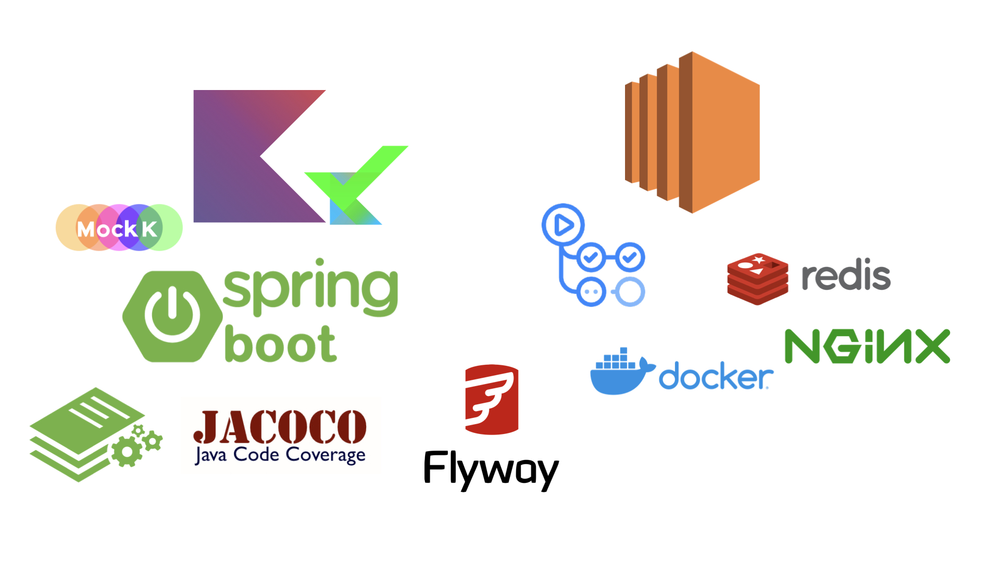
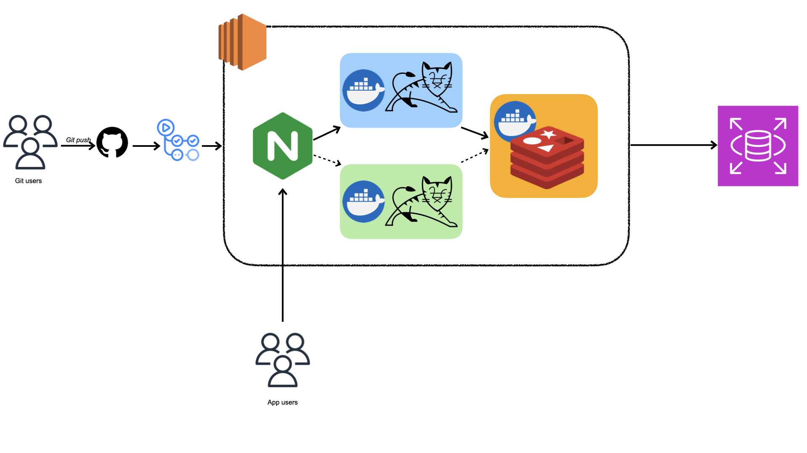

# 로스트아크 정보제공 플랫폼 Server
로스트아크에서 제공하는 open api를 사용해 개인화된 정보를 제공함과 동시에 일정관리를 돕는 앱 서버입니다.<br>
유저는 파편화된 게임의 정보를 직업 찾아다니지 않고 앱으로서 손쉽게 게임의 컨텐츠를 즐길 수 있습니다.

깃허브에서 제공하는 issue, project, actions 기능을 적극 이용하였으며 해당 레포지토리의 issue 페이지와 organization의 project 페이지에서 내용 확인이 가능합니다.

## 사용기술


## 프로젝트 진행시 관심사
- Domain Driven Design + CQRS pattern을 적용합니다.
- 배포과정에 DownTime이 없게 합니다.
- 모든 작업은 issue task를 통해 진행하며 협업에 집중합니다.
- 브랜치 커버리지를 80% 이상으로 유지합니다.
- 한 메서드의 라인수가 15줄을 넘기지 않습니다.
- 지속적으로 리팩터링 합니다.

## Infra Structure


## CI/CD
[문서 바로가기](doc/ci-cd.md)


## 시작하기
```shell
# 로컬 컨테이너 세팅
cd docker
docker-compose up -d
```

## http 사용해보기
1. intellij 접속 후 http 폴더로 이동
2. 테스트해보고 싶은 http 실행


